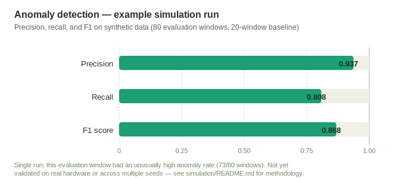

# Marine Ecosystem Monitoring System

**Status: (In Development) — no hardware purchased yet; hardware BOM/pricing and a power budget are still open.** Design documentation is locked (see [DECISIONS.md](DECISIONS.md)). Two implementation trees now exist: `simulation/` (synthetic-hardware proof of the ML pipeline, see below) and `edge/` (the real production Pi-side software — capture loop, calibration, telemetry, scheduler — runnable today in mock-hardware mode with zero hardware attached; see [docs/pi-implementation.md](docs/pi-implementation.md)).

| Precision | Recall | F1 |
|-----------|--------|-----|
| 0.937 | 0.808 | 0.868 |

Caveat: these numbers are from one simulation run with an unusually high injected anomaly rate (a storm runoff event covered most of the evaluation window), not a stable benchmark. See [simulation/README.md](simulation/README.md) for methodology.

## Motivation

Marine ecosystems generate continuous acoustic and environmental signal — biological activity, equipment/vessel noise, water-quality shifts, anomalous events — that's expensive to monitor with human observers or connectivity-dependent systems. This project designs a low-cost, edge-computed monitoring unit that combines passive acoustic monitoring with environmental sensing (temperature, pH, turbidity, salinity), correlates them on-device into a single feature space, and flags anomalies locally without depending on continuous high-bandwidth connectivity. The goal is a platform that's deployable on a solar-powered buoy or a fixed dock/pier mount using the same core hardware and software, reporting compact summaries over a low-bandwidth link while retaining full-resolution data for later retrieval.

## Documentation

- [DECISIONS.md](DECISIONS.md) — locked design decisions; the reference other docs are kept consistent with.
- [docs/architecture.md](docs/architecture.md) — full system architecture: sensor -> Pi -> processing -> telemetry -> storage/output flow, edge/offsite compute split, buoy/dock deployment profiles.
- [docs/hardware-spec.md](docs/hardware-spec.md) — component list and roles, interface considerations, enclosure/watertight considerations. Spec-level, no BOM yet.
- [docs/data-pipeline.md](docs/data-pipeline.md) — storage tiers, duty-cycle sampling flow, bulk retrieval process, SQLite schema sketch.
- [docs/ml-pipeline.md](docs/ml-pipeline.md) — 3-stage ML pipeline: feature extraction, unsupervised anomaly detection, future supervised classification.
- [docs/related-work.md](docs/related-work.md) — prior art and how this project's design differs.
- [docs/pi-implementation.md](docs/pi-implementation.md) — how `edge/` runs today in mock-hardware mode, the I2C wiring/address plan for when hardware exists, and systemd deployment.

## Implementation

- `simulation/` — synthetic-hardware proof that the ML pipeline design works end-to-end (see [simulation/README.md](simulation/README.md)).
- `edge/` — the real Pi-side production software: hardware abstraction layer (mock backend usable today, real backend stubbed for once hardware exists), capture loop, calibration, telemetry payload assembly, duty-cycle scheduler. Run `python -m edge.main --once` for a one-window smoke test. See [docs/pi-implementation.md](docs/pi-implementation.md).
- `tools/power_budget.py` — standalone power budget estimator (duty cycle vs. solar/battery sizing) using placeholder component draw figures, pending a priced BOM. Run `python tools/power_budget.py --help`.
- `deploy/marine-monitor.service` — systemd unit for running `edge/` unattended once real hardware is wired.

## Diagrams

`/diagrams` — reserved for architecture/data-flow diagrams derived from the docs above (not yet created).

## Documentation map

Suggested reading order, with why each doc sits where it does:

1. [docs/architecture.md](docs/architecture.md) — start here: the whole-system picture (sensor -> Pi -> processing -> telemetry -> storage/output) everything else is a component or detail of.
2. [docs/data-pipeline.md](docs/data-pipeline.md) — the storage/data-flow half of that architecture in detail: duty-cycle sampling, storage tiers, SQLite schema.
3. [docs/ml-pipeline.md](docs/ml-pipeline.md) — what happens to the data data-pipeline.md describes once it reaches Stage 1/2 feature extraction and anomaly detection.
4. [simulation/README.md](simulation/README.md) — the ml-pipeline.md design as running code: synthetic data standing in for real hardware, exercising the same pipeline end-to-end.
5. [docs/hardware-spec.md](docs/hardware-spec.md) — the physical components the architecture and pipeline above assume, once you want to know what they'd run on.
6. [docs/related-work.md](docs/related-work.md) — how the above design choices relate to existing prior art, useful once the design itself is understood.
7. [DECISIONS.md](DECISIONS.md) — last as a reference, not reading material: the locked decisions everything above is kept consistent with, for looking something up rather than reading start to end.
